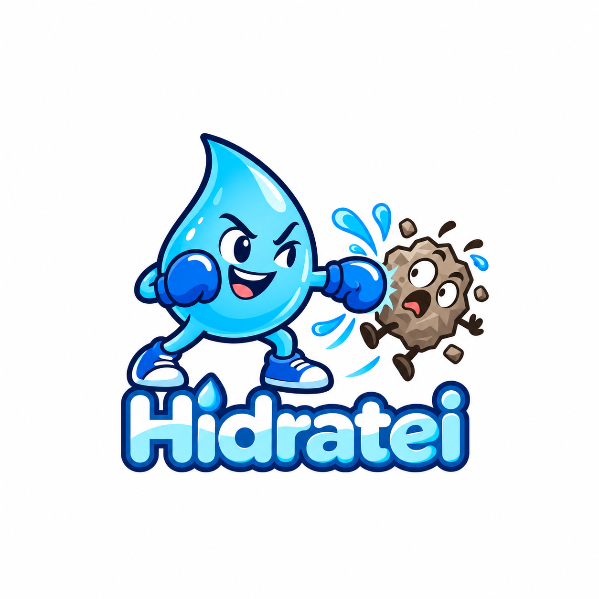

# Hidratei



O **Hidratei** é um aplicativo móvel que ajuda o usuário a acompanhar o consumo diário de água e manter uma rotina de hidratação. O app calcula uma meta inicial com base nas informações fornecidas durante a configuração, registra cada consumo e apresenta a evolução ao longo do dia.

Os dados são armazenados localmente no aparelho. Não é necessário criar conta, fazer login ou manter conexão com a internet para usar as funções principais.

## Funcionalidades

- Configuração inicial com sexo, peso e horários de acordar e dormir;
- Cálculo de uma meta diária inicial de hidratação;
- Registro rápido de 200 ml, 300 ml, 500 ml ou quantidade personalizada;
- Visualização do total consumido, percentual alcançado e quantidade restante;
- Exclusão de registros adicionados por engano;
- Histórico de consumo organizado por dia;
- Lembretes locais em horários configuráveis;
- Alteração da meta, intervalo e período dos lembretes;
- Persistência local de registros e preferências;
- Possibilidade de refazer a configuração inicial.

> O Hidratei é uma ferramenta de organização pessoal e não substitui orientação médica ou nutricional.

## Tecnologias

- React Native;
- TypeScript;
- Expo SDK 57;
- Expo Router;
- AsyncStorage;
- Expo Notifications.

## Arquitetura

O projeto utiliza o padrão **MVVM Simplificado**:

```text
src/
├── app/          # rotas e configuração da navegação
├── view/         # telas e componentes visuais
├── viewmodel/    # estados, ações, validações e navegação
└── model/        # entidades, regras, DataSources e Services
```

As ViewModels são implementadas como Custom Hooks e retornam o estado e as ações de cada tela:

```ts
const [state, actions] = useNomeDaViewModel();
```

## Como executar

### Pré-requisitos

- [Node.js](https://nodejs.org/) 22 ou superior;
- npm;
- Expo Go, emulador Android/iOS ou aparelho conectado.

### Instalação

Clone o repositório e acesse a pasta do projeto:

```bash
git clone https://github.com/gomes738/hidratei.git
cd hidratei
```

Instale as dependências:

```bash
npm install
```

Inicie o servidor de desenvolvimento:

```bash
npm start
```

Com o servidor aberto, escaneie o QR Code pelo Expo Go ou utilize uma das opções:

```bash
npm run android
npm run ios
npm run web
```

Também é possível pressionar `a`, `i` ou `w` no terminal do Expo para abrir a plataforma desejada.

## Gerar APK para Android

O perfil `preview` do EAS está configurado para gerar um APK instalável:

```bash
npx eas-cli login
npx eas-cli build -p android --profile preview
```

Ao concluir, o EAS exibirá um endereço para baixar e instalar o APK no Android.

## Armazenamento e privacidade

- Os registros e configurações ficam armazenados no próprio aparelho;
- O aplicativo não possui servidor ou banco de dados remoto;
- Não há cadastro de usuário ou sincronização em nuvem;
- A permissão de notificações é solicitada somente para os lembretes de hidratação.

## Licença

Este projeto está disponível sob a licença MIT. Consulte o arquivo [LICENSE](LICENSE).
